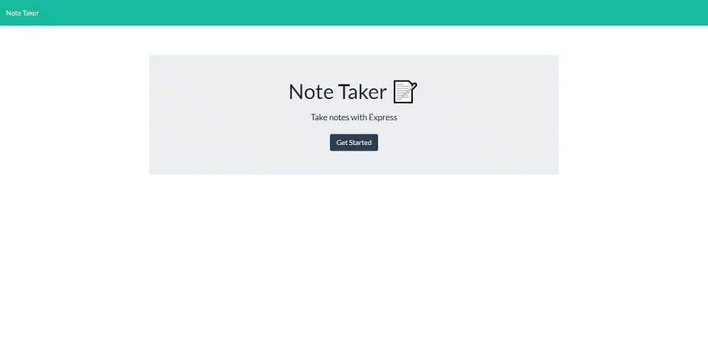
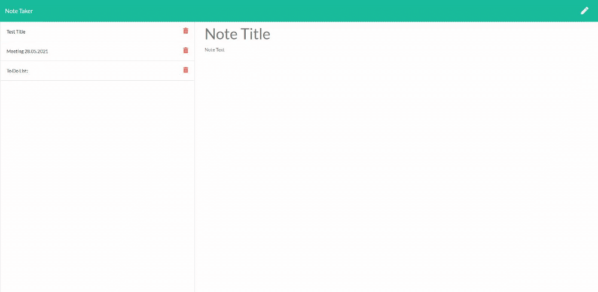

# Note-Taker

## This Github repository contains the code for a Note Taker application.

## This application can be used to write, save and delete notes.

---

## Table of Contents

* [Motivation and Research](#motivation-and-research)
* [Development](#development)
  * [Web development technologies](#web-development-technologies)
  * [Challenges](#challenges)
* [Future Development Opportunities](#future-development-opportunities)
* [Deployed Application Link:](#deployed-application-link)
* [Repository Link:](#repository-link)
* [Application Screenshots:](#application-screenshots)

---

## Motivation and Research

The motivation behind this project was to further develop my back end development skills utilising the Node.js runtime environment, specifically centered around the use of the express package.

This application allows a user to capture notes that are stored to a web server in JSON format. When the user returns to the application the notes are displayed to them in the order they have been entered, and can be removed as required, providing the user with a simple and functional note taker.

Notes are organised through the use of a title, allowing the user to sumarise the notes contents, and a body of text containing the note data. This allows the user to organise their content by topic and provides an easy to use, consistent experience when capturing and displaying their data. 

The application was created from my experience of spending a lot of time needing to capture small pieces of data or content while performing development and research work, alongside day to day notes such as reminders or to-do lists. By having a central location for this information the user is able to ensure that the data is available, able to be stored and recalled as appropriate and deleted when no longer relevant in an easy to use and functional interface.

## Development

### Web development technologies

Development of the project was centered around using Express, a back end web application for Node.js that is installed using the node package manager (npm).

Express is a minimal and flexible Node.js web application framework that provides a robust set of features for web and mobile applications.

Node.js, an open-source, cross-platform, back-end JavaScript runtime environment that runs on the V8 engine and executes JavaScript code outside a web browser.

This application has been deployed on Heroku, a Cloud Application Platform as a Service (PaaS) that supports several programming languages including Node.
 
Links to the languges and tools used to build this project are included below:

* Javascript ES6
* Express
    * https://expressjs.com/
* Node.js
    * https://nodejs.org/
* npm
    * https://www.npmjs.com/
* Heroku
    * https://www.heroku.com/

### Challenges

The development of this application required the use of Node.js and npm, including the installation of the Express.js package.
In my previous projects I have used GitHub to deploy my applications, however GitHub pages will not execute any server side code; this meant I had to use another web application. For this project I deployed my application using Heroku.
These were new technologies for me as a web developer and required testing and research to understand these tools in order to implement them to create a working project for other users.

## Future Development Opportunities

Future development opportunities for the application include the ability to modify existing notes, allowing the user to edit the content of a note, or complete individual tasks that have been listed within the note body text. 

Allowing the user to sort or arrange existing notes is another opportunity for improvement, along with search functionality, providing the user with the ability to quickly locate the relevant content within their notes. Sharing note content with other users of the application would allow for a more collaborative experience.

Adding the ability for users to upload relevant content such as images or files would provide better functionality for the user, by allowing them to save data relevant to the note such as screenshots, associated files or other data.

Applying a more consistent branding experience that is aligned to my other applications is also planned, reflecting my professional brand and providing a consistent UI experience across all of my developed applications.

---

**Thank you for visiting.**

---

### Deployed Application Link:

* https://serene-temple-28914.herokuapp.com/

---

### Repository Link:

* https://github.com/blmccavanagh/Note-Taker

---

### Application Screenshots:

*Note Taker User Interface introduction, adding a note using the UI.* 

---

*Retrieveing saved notes, switching between saved notes and deleting notes using the UI.*

---